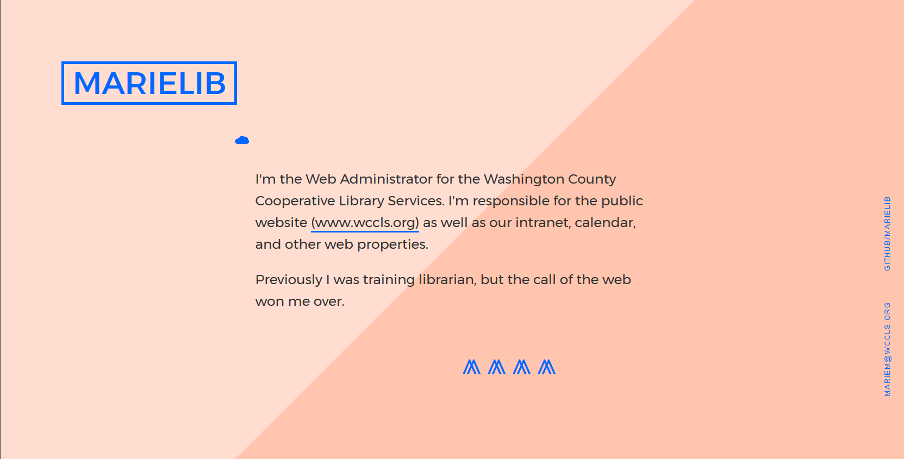
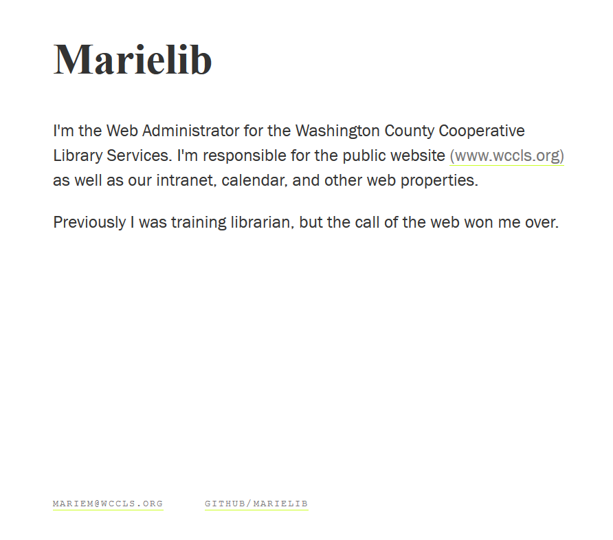

# Hello Page




A so very simple personal site.

This was forked from the  [Fork-n-Go](http://jlord.github.io/forkngo) project, then forked again from Kate B's project for class.

To see the original demo, go to [jlord.github.io/hello](http://jlord.github.io/hello).

My repository is here: [marielib.github.io/demo_website](https://marielib.github.io/demo_website/).


### First, fork this repository.

Click the fork button in the upper right. Now you have a copy of this repository on your GitHub account!

### Rename your fork

Once you've forked it, click on Settings and rename your fork, because probably `hello` is not what you want in your URL.
You can give it any 'ol name and GitHub will host it using this patter: `username.github.io/reponame`. Or you can keep it named `demo_website` and find it at: `username.github.io/demo_website`.

### Make yours live

1. From your fork's page on GitHub, click the clone button to copy the repository URL to your clipboard.
2. Clone your fork to your own computer.
3. Make changes to the index.html so that the site reflects your name and bio. You might also want to change this README file (it's written in [Markdown](https://github.com/adam-p/markdown-here/wiki/Markdown-Cheatsheet)).
4. Add + commit your changes, and push back to GitHub. Remember that you are on the gh-pages fork, not the master.

Now your site is live! Go check it out!


### Style

There are basic styles included in `style.css` but go wild and make it your own, try other things!

### Bonus Style



There is another style option included within this repository. If you change the CSS file specified on **line 7** in `index.html` to:

```HTML
<link rel="stylesheet" type="text/css" href="css/style.css"
```

Then you'll get the other option! Commit your changes to make it live. Change the file called for back to `css/style2.css` to go back to the other.
